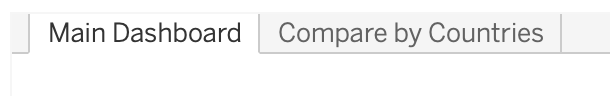
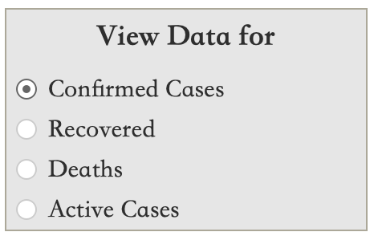
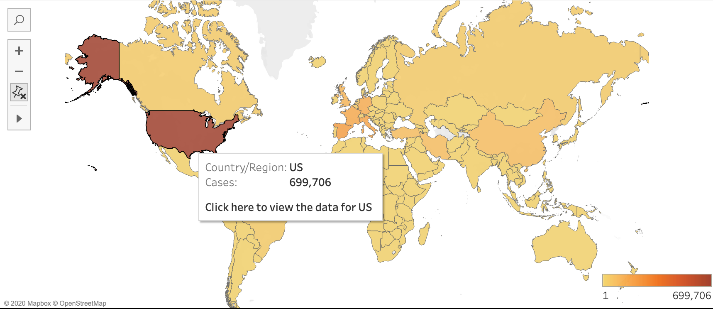
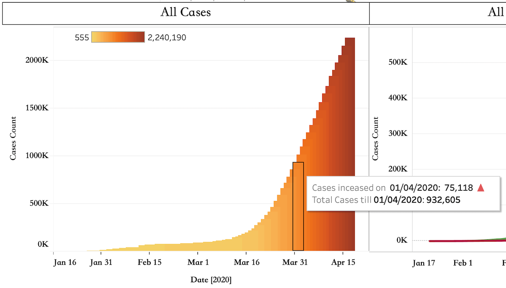
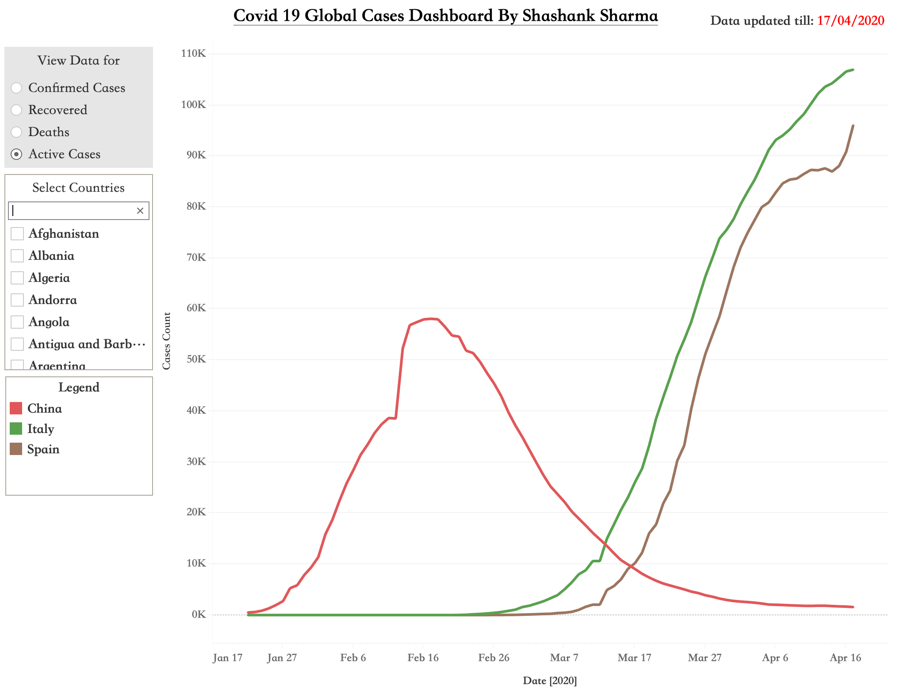

# COVID-19-Global-Cases-Dashboard

Link to the dashboard: https://bit.ly/covid_19_dashboard

While it is crucial for everyone to take self quarantine seriously amidst the corona virus pandemic, it is also important that a state of panic is avoided. Medical services around the globe are working hard and their efforts are evident as the number of recovered cases increase at decent rate everyday. 

The dashboard is designed  to show the full picture of the situation with emphasis on the recovered cases to underscore the efforts of doctors around the globe. I would like to thank John Hopkins University Center for Systems Science and Engineering (JHU CSSE) for collating data from multiple sources and publishing it on a daily basis for educational use. 

# Dashboard using Tableau Desktop

The dashboard contains two tabs explained as shown below:

* "Main dashboard" displays in depth to analyse the condition in glob 
* "Compare by countries" allows the user to compare the change in cases between multiple countries to get a deeper understanding of the spread of the virus.

## 1. Main Dashboard

In the next sections, the purpose and features of each content of the Main dashboard are explained in detail.

### 1.1 Selecting the type of data to display

Purpose: Controls the type of data (Confirmed Cases, deaths, active, recovery) visualised on the main page of the dashboard.

Feature: Being a radiobutton, only one selection is possible at a time which allows an in-depth analysis for each type of case.

### 1.2 List of Countries

Purpose: Displays the total cases to date in a descending order for each country. 'Total' shows the cumulative global cases.

Features: 
* Click to view country data: Clicking on any country in the list updates the data for that particular country on all the visualisations in the dashboard. 
* Switch back to global data: Clicking on 'Total' switches back the dashboard to the default state displaying global data.

### 1.3 Interactive Map

Purpose: Displays the data for all countries in an interactive map colour shaded with yellow for countries with a low number of cases varying to red for the most number of cases.

Features: 
* Click to view country data: Clicking on any country in the map updates the data for that particular country on all the visualisations in the dashboard. 
* Switch back to global data: Clicking on white space (any ocean) switches back the dashboard to the default state displaying global data.

### 1.4 Cumulative cases

Purpose: Displays the trend in increase/decrease of cases with time. 

Feature: 
* Hovering on the plot shows the exact number of cases added on a particular day along with the cumulative cases till that date.

### 1.5 Recovered vd Death

Purpose: Displays the growth in recovered cases vs death to underscore the efforts of medical services. 

Feature: 
* Hovering on the plot shows the exact number of cases till that date.

## 2. Compare by Countries

Purpose: Compare the change in cases between multiple countries to get a deeper understanding of the spread of the virus.

Features:
* Selecting the data: The type of data displayed can be changed using the 'View data for' radiobutton.
* Selecting countries: Any number of countries can be selected from the 'Select Countries' section to add their data to the plot. The legend will get updated automatically with every selection.
* Hovering on the plot shows the exact number of cases till that date.
