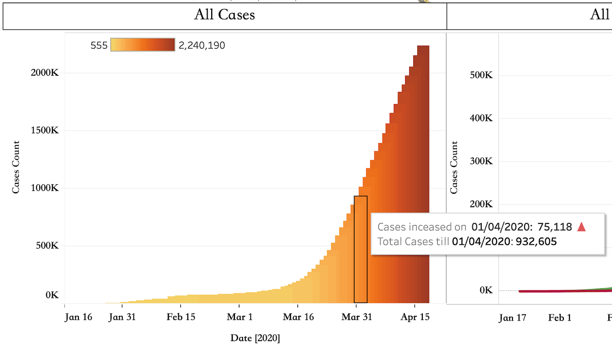

# Data Shaping using Tableau Prep Builder

Tableau Prep Builder was used to clean, pivot and join the three data sources for confirmed, recovered and deaths.  The entire flow of transforming the data is shown below.

The main puprose of the above transformation is to convert the data from a wide format to a long format with a cumulative sum of cases for each country for each date.  The transformed dataset is saved in a hyper format which is a Tableau's in-memory data engined technology to optinize data ingestion. 

# Dashboard using Tableau Desktop

The dashboard contains two tabs explained as shown below:

* "Main dashboard" displays global data in default stae which can be changes to country specific data.
* "Compare by countries" allows the user to compare the cases in multiple countries. 

## 1. Main Dashbaord

In the next sections, the purpose and features of each contents of the Main dashboard are explained in detail.

### 1.1 Selecting the type of data to display

Purpose: Controls the type of data (Confirmed Cases, deaths, active, recovery) visualised on the main page of the dashboard.

Feature: Being a radiobutton, only one selection is possible at a time which allows an in depth analysis for each type of case.

### 1.2 List of Countries

Purpose: Displays the total cases till date in a descending order for each country. 'Total' shows the cumulative global cases.

Features: 
* Click to view country data: Clicking on any country in the list updates the data for that particular country on all the visualisations in the dashboard. 
* Switch back to global data: Cicking on 'Total' switches back the dashboard to the default state displaying gloabl data.

### 1.3 Interactive Map

Purpose: Displays the data for all countries in an interactive map colour shaded with yellow for countires with low number of cases varying to red for the most number of cases.

Features: 
* Click to view country data: Clicking on any country in the map updates the data for that particular country on all the visualisations in the dashboard. 
* Switch back to global data: Cicking on white space (any ocean) switches back the dashboard to the default state displaying gloabl data.

### 1.4 Cumulative cases

Purpose: Displays the trend in increase/decrease of cases with time. 

Feature: 
* Hovering on the plot shows the exact number of cases added on a particular day along with the cumulative cases till that date.

### 1.5 Recovered vd Death

Purpose: Displays the growth in recovered cases vs death to underscore the efforts of medical services. 

Feature: 
* Hovering on the plot shows the exact number of cases till that date.

## 2. Compare by Countries

Purpose: Compare the change in cases between multiple countries to get a deeper understanding of the spread of the virus.

Features:
* Selecting the data: The type of data displayed can be changed using the 'View data for' radiobutton.
* Selecting countries: Any number of countries can be selected from the 'Select Countries' section to add its data to the plot. The legend will get updated automatically with every selection.
* Hovering on the plot shows the exact number of cases till that date.
